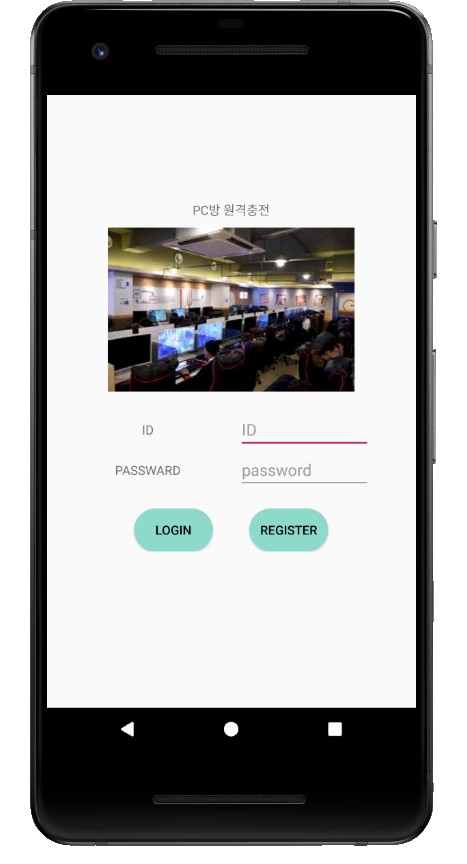
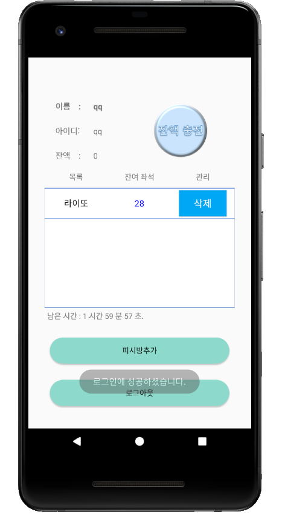
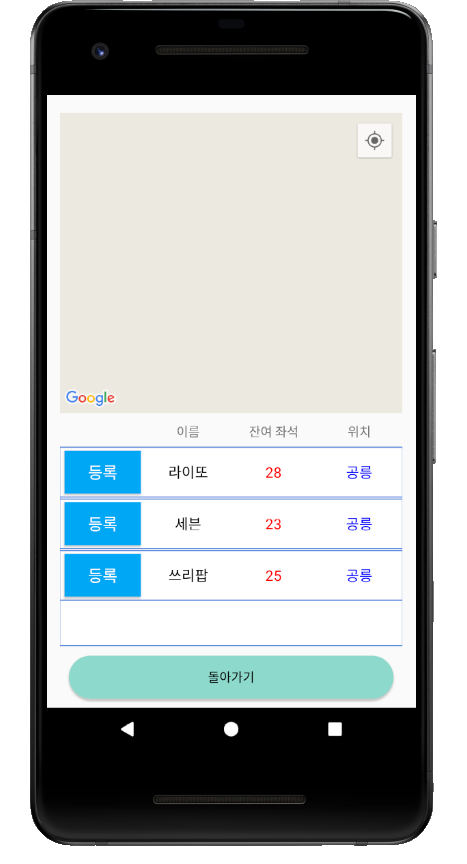
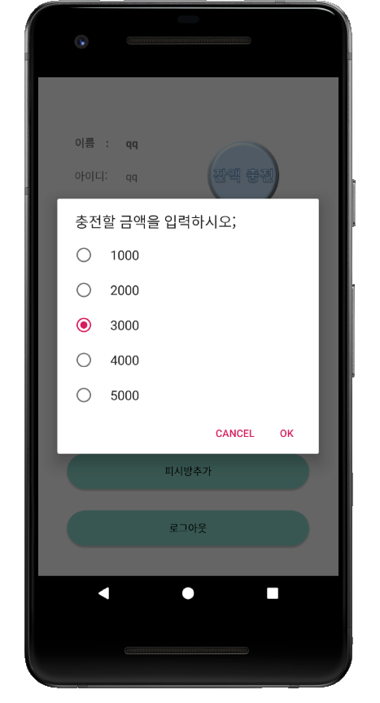
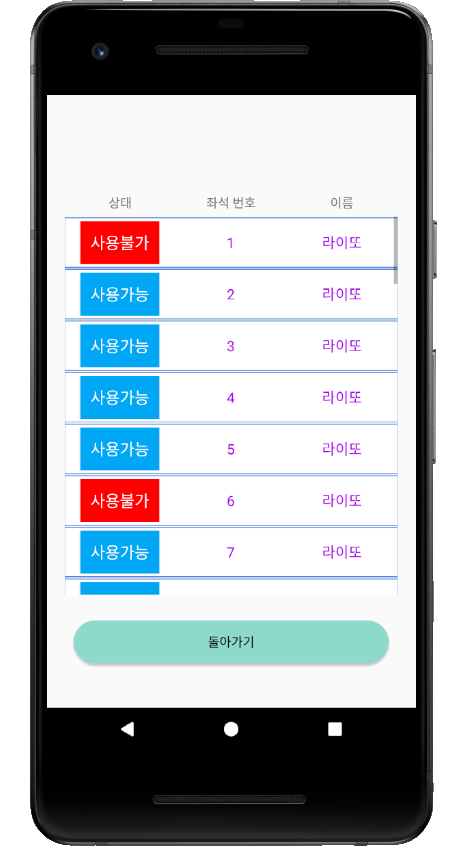
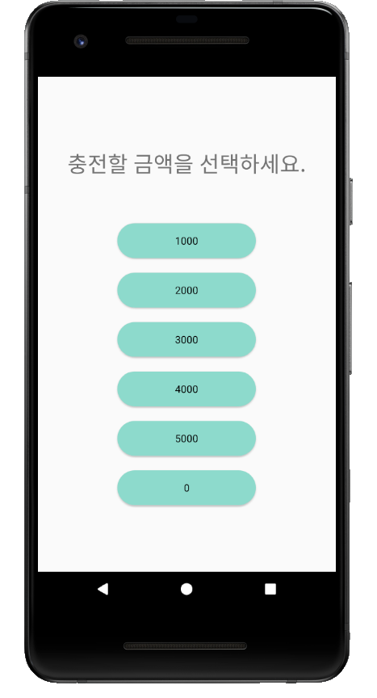
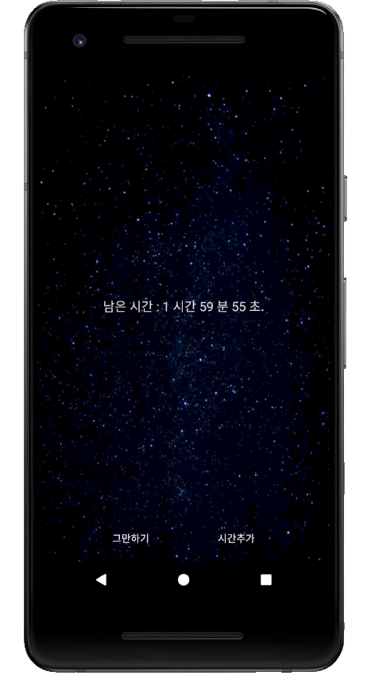

# android_pcroomApp
피시방 결제 연동 어플 프로토타입입니다.

Screenshot
----------

MainFunction
-----------

1.로그인,회원가입

2.잔액 충전

3.피시방 등록
- 자신이 즐겨찾는 피시방을 등록한다.

4.좌석 등록
- 사용 가능한 좌석과 불가능한 좌석을 표시
- 좌석 사용이 시작되면 사용하는 시간동안은 사용이 불가능하게 구현
- 좌석이 사용되면 잔여좌석도 줄어들게 만듬

5.시간 저장
- 사용이 종료되면 남은 시간이 저장됨
